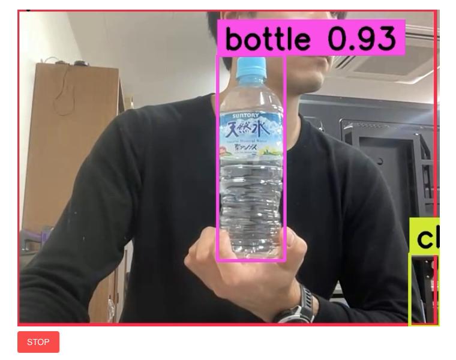

# YOLOv8_object_detection_streamlit

### Deploy your Object Detection app in Streamlit using YOLOv8 model (COCO dataset).
#### Check the DEMO here: https://mariotsato-yolov8-object-detection-streamlit-app-9gw2rr.streamlit.app

### References:
- <a href="https://github.com/niconielsen32/YOLOv8-Class">niconielsen32/YOLOv8-Class</a>
- <a href="https://github.com/whitphx/streamlit-webrtc">whitphx/streamlit-webrtc</a>

*Feel free to use/change/share the code
